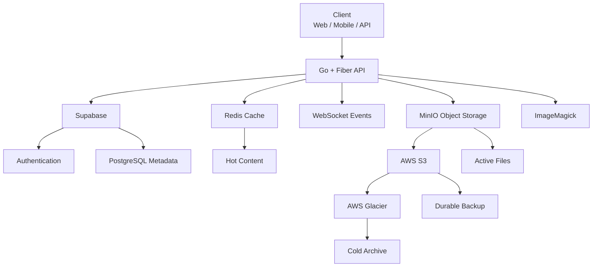

<div align="center">

# ⚡ Packet CDN

### **Store · Cache · Process · Deliver**

A modular, cloud-ready file storage and content delivery platform designed for fast, scalable and reliable file management.

<br />


<br />

**A modular storage and delivery infrastructure for modern applications.**

</div>

---

## 📌 Overview

**Packet CDN** is a modular cloud file-storage and content-delivery platform built to handle the complete lifecycle of digital files:

```text
Upload
   ↓
Authenticate
   ↓
Process
   ↓
Store
   ↓
Cache
   ↓
Deliver
   ↓
Archive
```

Instead of relying on a single storage layer, Packet CDN separates:

- Authentication
- Metadata
- Object storage
- Caching
- Image processing
- Real-time events
- Cloud backup
- Long-term archival

This allows each part of the system to scale independently.

---

## 🎯 Why Packet CDN?

Traditional file-storage systems often tightly couple application logic with storage.

Packet CDN takes a modular approach:

```text
Application
     │
     ▼
┌───────────────┐
│   Go + Fiber  │
│   API Layer   │
└───────┬───────┘
        │
 ┌──────┼─────────────┐
 │      │             │
 ▼      ▼             ▼
Auth   Cache       Storage
 │      │             │
 ▼      ▼             ▼
DB    Redis         MinIO
                     │
              ┌──────┴──────┐
              ▼             ▼
            AWS S3       Glacier
```

The result is a system designed around:

> **Performance + Modularity + Scalability + Reliability**

---

# ✨ Features

| Feature | Description |
|---|---|
| 📁 File Management | Upload, download, organize and delete files |
| 🔐 Authentication | Secure user authentication through Supabase |
| 👤 User Isolation | Files are scoped to their owners |
| ⚡ Redis Caching | Frequently accessed content can be served from cache |
| 🗄️ Object Storage | S3-compatible MinIO storage |
| ☁️ Cloud Backup | AWS S3 durability layer |
| ❄️ Archival | AWS Glacier for long-term storage |
| 🖼️ Image Processing | Resize, compress and convert images |
| 🔄 Real-Time Events | WebSocket-based upload and processing updates |
| 🐳 Docker | Containerized local development |
| ☸️ Kubernetes | Production-oriented orchestration |
| 📊 Health Monitoring | Service health endpoint |
| 🚀 Horizontal Scaling | Stateless API architecture |

---

# 🧠 Core Architecture



---

# 🔄 File Lifecycle

Every uploaded file follows a controlled lifecycle:

```text
┌──────────┐
│  Upload  │
└────┬─────┘
     ↓
┌──────────────┐
│ Authentication│
│   Supabase   │
└────┬─────────┘
     ↓
┌──────────────┐
│  Go + Fiber  │
│     API      │
└────┬─────────┘
     ↓
┌──────────────┐
│ ImageMagick  │
│  Processing  │
└────┬─────────┘
     ↓
┌──────────────┐
│    MinIO     │
│ Active Store │
└────┬─────────┘
     │
     ├──────────────► Redis
     │                 Cache
     │
     └──────────────► AWS S3
                       Backup
                         │
                         ▼
                    AWS Glacier
                      Archive
```

---

# ⚡ Request Flow

For a frequently requested file:

```text
Client
  │
  ▼
Packet CDN API
  │
  ▼
Redis
  │
  ├── Cache HIT ──────► Return Content
  │
  └── Cache MISS
          │
          ▼
        MinIO
          │
          ▼
      Return Content
          │
          ▼
      Populate Cache
```

### Cache Hit

```text
Client → API → Redis → Response
```

### Cache Miss

```text
Client → API → Redis → MinIO → Response
```

Caching reduces repeated storage access and can lower latency and backend workload.

---

# 🏗️ Technology Stack

| Layer | Technology | Purpose |
|---|---|---|
| Backend | Go | Core application |
| HTTP Framework | Fiber | High-performance API |
| Authentication | Supabase Auth | User authentication |
| Database | PostgreSQL / Supabase | Metadata and user data |
| Object Storage | MinIO | Active file storage |
| Cache | Redis | Frequently accessed content |
| Cloud Storage | AWS S3 | Durable cloud backup |
| Archive | AWS Glacier | Long-term storage |
| Processing | ImageMagick | Image manipulation |
| Real-Time | WebSockets | Live events and progress |
| Containers | Docker | Development and deployment |
| Orchestration | Kubernetes | Production scaling |

---

# 📂 Project Structure

```text
Packet-CDN/
│
├── cmd/
│   └── ...                    # Application entry points
│
├── internal/
│   ├── api/
│   │   ├── handlers/          # HTTP handlers
│   │   ├── routes/            # API routes
│   │   └── middleware/        # API middleware
│   │
│   ├── auth/
│   │   └── ...                # Authentication logic
│   │
│   ├── cache/
│   │   └── ...                # Redis integration
│   │
│   ├── storage/
│   │   └── ...                # MinIO / S3 integration
│   │
│   └── websocket/
│       └── ...                # Real-time events
│
├── config/
│   └── ...                    # Application configuration
│
├── deployments/
│   ├── docker/
│   │   └── ...                # Docker configuration
│   │
│   └── kubernetes/
│       └── ...                # Kubernetes manifests
│
├── scripts/
│   └── ...                    # Development utilities
│
├── Dockerfile
├── docker-compose.yml
├── go.mod
├── go.sum
├── .env.example
├── .gitignore
└── README.md
```

> The exact tree may evolve as the implementation grows.

---

# 🚀 Getting Started

## Requirements

Before running Packet CDN locally, install:

- Go `1.21+`
- Docker
- Docker Compose
- Redis
- MinIO
- ImageMagick
- A Supabase project
- AWS account for cloud-storage features

---

## 1. Clone the Repository

```bash
git clone https://github.com/Pradyum-02/Packet-CDN.git
cd Packet-CDN
```

---

## 2. Install Dependencies

```bash
go mod download
```

---

## 3. Configure Environment Variables

Create:

```text
.env
```

Example:

```env
# ==========================================
# APPLICATION
# ==========================================

PORT=3000
ENVIRONMENT=development


# ==========================================
# SUPABASE
# ==========================================

SUPABASE_URL=your_supabase_url
SUPABASE_ANON_KEY=your_supabase_anon_key
SUPABASE_SERVICE_ROLE_KEY=your_supabase_service_role_key


# ==========================================
# DATABASE
# ==========================================

DATABASE_URL=your_database_url


# ==========================================
# REDIS
# ==========================================

REDIS_HOST=localhost
REDIS_PORT=6379
REDIS_PASSWORD=


# ==========================================
# MINIO
# ==========================================

MINIO_ENDPOINT=localhost:9000
MINIO_ACCESS_KEY=your_access_key
MINIO_SECRET_KEY=your_secret_key
MINIO_BUCKET=packet-cdn


# ==========================================
# AWS
# ==========================================

AWS_REGION=your_region
AWS_ACCESS_KEY_ID=your_access_key
AWS_SECRET_ACCESS_KEY=your_secret_key
AWS_S3_BUCKET=your_bucket


# ==========================================
# WEBSOCKETS
# ==========================================

WEBSOCKET_ENABLED=true
```

### ⚠️ Never commit secrets

Your `.gitignore` should include:

```gitignore
.env
.env.*
!.env.example
```

Never commit:

```text
SUPABASE_SERVICE_ROLE_KEY
AWS_SECRET_ACCESS_KEY
MINIO_SECRET_KEY
DATABASE_PASSWORD
```

---

# 🗄️ Supabase Database Model

Packet CDN uses Supabase for authentication and metadata.

Conceptually:

```text
User
│
├── Authentication
│
├── Profile
│
└── Files
     │
     ├── file_name
     ├── file_size
     ├── mime_type
     ├── storage_key
     ├── owner_id
     └── created_at
```

The database stores metadata rather than replacing the object-storage layer.

---

# 🐳 Docker

Packet CDN can be run using Docker.

### Build

```bash
docker build -t packet-cdn .
```

### Run

```bash
docker run -p 3000:3000 packet-cdn
```

### Start the development stack

```bash
docker compose up -d
```

### Check running services

```bash
docker ps
```

### Stop services

```bash
docker compose down
```

---

# ☸️ Kubernetes

For Kubernetes deployments:

```bash
kubectl apply -f deployments/kubernetes/
```

Check the deployment:

```bash
kubectl get pods
```

Check exposed services:

```bash
kubectl get services
```

The API layer is designed to be stateless, allowing multiple application instances to run behind a load balancer.

---

# 🔌 API Reference

## Authentication

| Method | Endpoint | Description |
|---|---|---|
| `POST` | `/api/auth/register` | Create a user |
| `POST` | `/api/auth/login` | Authenticate a user |
| `POST` | `/api/auth/logout` | End the current session |

---

## Files

| Method | Endpoint | Description |
|---|---|---|
| `POST` | `/api/files/upload` | Upload a file |
| `GET` | `/api/files` | List authenticated user's files |
| `GET` | `/api/files/:id` | Retrieve file metadata |
| `GET` | `/api/files/:id/download` | Download a file |
| `DELETE` | `/api/files/:id` | Delete a file |

---

## Storage

| Method | Endpoint | Description |
|---|---|---|
| `GET` | `/api/storage` | Storage-layer status |
| `GET` | `/api/storage/:key` | Retrieve an object by storage key |

---

## Health

```http
GET /health
```

Example:

```json
{
  "status": "ok"
}
```

---

# 🔄 WebSocket Events

Packet CDN supports real-time lifecycle events.

```text
upload.started
       ↓
upload.progress
       ↓
processing
       ↓
upload.complete
```

If an operation fails:

```text
upload.started
       ↓
upload.progress
       ↓
processing
       ↓
error
```

This allows clients to receive updates without repeatedly polling the API.

---

# 📜 Logging

Packet CDN should use structured application logs so that requests and failures can be traced across services.

Example:

```text
2026-10-09T01:20:31Z INFO  server started
2026-10-09T01:20:32Z INFO  redis connection established
2026-10-09T01:20:32Z INFO  minio connection established
2026-10-09T01:20:33Z INFO  websocket service enabled
2026-10-09T01:20:45Z INFO  upload started file=example.png
2026-10-09T01:20:46Z INFO  image processing completed
2026-10-09T01:20:47Z INFO  object stored key=uploads/example.png
2026-10-09T01:20:47Z INFO  upload completed
```

### Error Example

```text
2026-10-09T01:21:02Z ERROR storage upload failed
file=example.png
storage=minio
error="connection refused"
```

### Recommended Log Levels

```text
DEBUG
INFO
WARN
ERROR
```

Use `DEBUG` during development and avoid exposing secrets or credentials in logs.

---

# 🔍 Observability

Important events to monitor include:

```text
API Requests
     │
     ├── Request Count
     ├── Response Time
     ├── Error Rate
     └── Status Codes
     
Storage
     │
     ├── Uploads
     ├── Downloads
     ├── Storage Usage
     └── Failed Operations

Redis
     │
     ├── Cache Hits
     ├── Cache Misses
     └── Connection Health

WebSockets
     │
     ├── Active Connections
     ├── Upload Events
     └── Processing Events
```

---

# 🔐 Security

Packet CDN is designed around several security principles.

### Authentication

Supabase manages authentication and sessions.

### Authorization

Every file-access operation should verify ownership before returning or modifying data.

```text
Request
   ↓
Authenticate
   ↓
Identify User
   ↓
Verify Ownership
   ↓
Allow / Deny
```

### Storage Security

Private objects should be accessed through controlled, time-limited URLs rather than exposing permanent storage credentials.

### File Validation

Uploaded files should be validated before processing or storage.

### Secrets

Credentials must remain in environment variables or a dedicated secrets-management system.

---

# 📈 Scalability

Packet CDN is designed to scale horizontally.

```text
                    ┌───────────────┐
                    │ Load Balancer │
                    └───────┬───────┘
                            │
          ┌─────────────────┼─────────────────┐
          │                 │                 │
          ▼                 ▼                 ▼
     ┌─────────┐       ┌─────────┐       ┌─────────┐
     │ API #1  │       │ API #2  │       │ API #3  │
     └────┬────┘       └────┬────┘       └────┬────┘
          │                 │                 │
          └─────────────────┼─────────────────┘
                            │
                 ┌──────────┴──────────┐
                 │                     │
                 ▼                     ▼
              Redis                  MinIO
                 │                     │
                 └──────────┬──────────┘
                            │
                            ▼
                       Cloud Storage
```

Because the API layer is stateless, additional instances can be added as traffic increases.

---

# 🧪 Development

Run the application locally:

```bash
go run .
```

Run tests:

```bash
go test ./...
```

Build the application:

```bash
go build -o packet-cdn
```

Run the compiled binary:

```bash
./packet-cdn
```

---

# 🩺 Troubleshooting

| Problem | Possible Cause | Solution |
|---|---|---|
| API does not start | Incorrect environment configuration | Check `.env` |
| Redis unavailable | Redis not running | Start Redis/Docker service |
| MinIO unavailable | MinIO not running | Start MinIO |
| Database errors | Invalid Supabase credentials | Verify environment variables |
| Upload fails | Storage configuration | Check MinIO bucket and credentials |
| Image processing fails | ImageMagick unavailable | Install/check ImageMagick |
| WebSocket unavailable | WebSocket configuration | Check `WEBSOCKET_ENABLED` |
| Docker service exits | Configuration/runtime error | Inspect `docker logs` |

### Docker Logs

```bash
docker logs <container_name>
```

### Follow Logs

```bash
docker logs -f <container_name>
```

---

# 📊 Project Status

> **Development / Active Build**

Packet CDN is an evolving infrastructure project.

### Implemented

- [x] Go + Fiber backend
- [x] Supabase authentication and metadata
- [x] MinIO object storage
- [x] Redis caching architecture
- [x] Docker support
- [x] Image processing pipeline
- [x] WebSocket event architecture
- [x] AWS S3 storage integration architecture
- [x] AWS Glacier archival architecture
- [x] Kubernetes deployment structure

### In Progress

- [ ] Folder hierarchy
- [ ] Public/private shareable links
- [ ] Client-facing upload progress
- [ ] Storage usage dashboard
- [ ] Usage analytics

### Planned

- [ ] File versioning
- [ ] Trash and recovery
- [ ] Expiring links
- [ ] Granular permissions
- [ ] Team workspaces
- [ ] CDN edge caching
- [ ] Automated archival policies
- [ ] Desktop synchronization
- [ ] Mobile application

---

# 🗺️ Roadmap

```text
                    PACKET CDN
                        │
          ┌─────────────┴─────────────┐
          │                           │
      STORAGE                    DELIVERY
          │                           │
          ▼                           ▼
      MinIO / S3                  Redis
          │                           │
          ▼                           ▼
       Glacier                  Edge Cache
          │                           │
          └─────────────┬─────────────┘
                        │
                        ▼
                   GLOBAL CDN
                        │
                        ▼
                HIGH-SCALE DELIVERY
```

---

# 🤝 Contributing

Contributions are welcome.

### 1. Fork the repository

```bash
git clone https://github.com/Pradyum-02/Packet-CDN.git
cd Packet-CDN
```

### 2. Create a feature branch

```bash
git checkout -b feature/my-feature
```

### 3. Make your changes

Keep changes focused and maintainable.

### 4. Run tests

```bash
go test ./...
```

### 5. Commit

```bash
git commit -m "feat: add my feature"
```

### 6. Push

```bash
git push origin feature/my-feature
```

### 7. Open a Pull Request

Explain:

- What changed
- Why it changed
- How it was tested
- Any known limitations

---

# 📝 Commit Convention

Recommended commit format:

```text
feat: add new functionality
fix: resolve a bug
docs: update documentation
refactor: improve internal structure
test: add or update tests
chore: maintenance changes
perf: improve performance
security: security-related changes
```

Example:

```bash
git commit -m "feat: add redis cache layer"
```

---

# 🛡️ Security Guidelines

If you discover a security issue:

1. Do not publish sensitive credentials.
2. Do not commit secrets into the repository.
3. Rotate compromised credentials immediately.
4. Report the issue privately to the project maintainer.

Never include these values in source code:

```text
AWS_SECRET_ACCESS_KEY
SUPABASE_SERVICE_ROLE_KEY
MINIO_SECRET_KEY
DATABASE_PASSWORD
```

---

# 📄 License

Packet CDN is released under the **MIT License**.

See the [`LICENSE`](LICENSE) file for the complete license text.

---

# 👨‍💻 Project

**Packet CDN**

> Store · Cache · Process · Deliver

Repository:

https://github.com/Pradyum-02/Packet-CDN

---

<div align="center">

### ⚡ Packet CDN

**Modular storage. Intelligent caching. Reliable delivery.**

Built with Go · Redis · MinIO · Supabase · AWS · Docker

</div>
